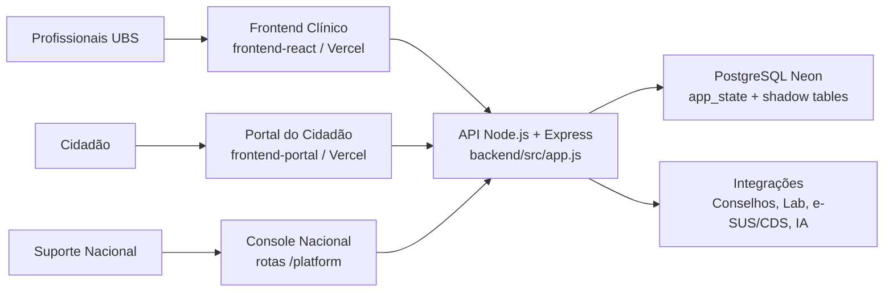

# SYSTEM OVERVIEW

## Objetivo
Consolidar visão executiva e técnica do VITRAS com base exclusiva no código atual, infraestrutura declarada e artefatos internos do repositório.

## Escopo
Cobertura de produto, arquitetura de alto nível, stack, públicos, conceitos fundamentais e glossário oficial.

## Pré-requisitos
- Leitura de `README.md`
- Leitura de `backend/src/app.js`
- Leitura de `backend/src/db.js`
- Leitura de `backend/src/utils/helpers.js`
- Leitura de `docs/ai/routes-map.md`
- Leitura de `docs/ai/entities-map.md`

## Descrição
VITRAS é plataforma de atenção primária à saúde orientada a UBS e município. Sistema cobre operação clínica, operação territorial, gestão de usuários, trilha de auditoria, LGPD, integração laboratorial, exportação CDS/e-SUS, console nacional de suporte/implantação e portal do cidadão.

### O que é o VITRAS
- Prontuário e operação APS/ESF para UBS
- Camada operacional para agenda, fila, atendimentos, visitas ACS, exames, encaminhamentos, farmácia, insumos e auditoria
- Camada platform para implantação multi-UBS e suporte nacional
- Camada cidadã para jornada digital do paciente em portal separado

### Objetivos
- Sustentar operação clínica e territorial de APS
- Garantir segregação por perfil, equipe, UBS e município
- Registrar rastreabilidade assistencial, operacional e de segurança
- Viabilizar implantação municipal com governança e suporte central
- Preparar integração e homologação com ecossistema e-SUS/CDS

### Escopo funcional atual
#### IMPLEMENTADO
- Autenticação JWT com refresh token e CSRF para cookie auth
- 2FA TOTP para usuário interno
- RBAC por capabilities e roles clínicas, operacionais, suporte e emergência
- Cadastro e busca de pacientes com mascaramento e criptografia de identificadores
- Prontuário com registros clínicos e soft-delete
- Agenda, fila, tarefas, mensagens, exames, encaminhamentos
- Farmácia, receitas, dispensações, almoxarifado e insumos
- Cadastro domiciliar, microáreas, visitas ACS e busca ativa
- Indicadores territoriais e operacionais por engine de atribuição
- Auditoria com cadeia hash, relatórios e verificação de integridade
- Console nacional `/platform/*` para municípios, UBS, equipes e gestor inicial
- Portal do cidadão em frontend separado

#### PARCIAL
- OpenAPI cobre parte relevante, mas não totalidade das rotas atuais
- Modelo relacional completo existe em tabelas shadow, enquanto fonte de verdade segue JSONB em `app_state`
- Homologação técnica possui checklists e artefatos, mas depende de evidências por implantação

#### ROADMAP
- Não documentado como implementado neste volume. Referir-se apenas a artefatos formais já existentes em `docs/roadmap/` e `organization/07-produto/roadmap.md`.

## Público-alvo
- Equipes de TI municipal
- Segurança da informação e auditoria
- Sustentação e SRE/DevOps
- Novos desenvolvedores
- Gestores de implantação
- Equipes de homologação

## Arquitetura em alto nível

## Stack tecnológica
| Camada | Stack | Evidência |
|---|---|---|
| Frontend clínico | React 18, Vite 5 | `frontend-react/package.json` |
| Portal cidadão | React 18, Vite 5 | `frontend-portal/package.json` |
| Backend | Node.js 22, Express 4, ESM | `backend/package.json` |
| Banco | PostgreSQL Neon ou arquivo local em dev | `backend/src/db.js` |
| Segurança | JWT, TOTP, AES-256-GCM, HMAC-SHA256, Helmet, CORS, rate limit | `backend/src/middlewares/*`, `backend/src/services/*` |
| Deploy | Vercel, Render, Neon | `README.md`, `render.yaml` |

## Conceitos fundamentais
- `Unit`: UBS operacional
- `Team`: equipe vinculada à UBS
- `Municipality`: município de implantação
- `Patient Global`: paciente identificado por contexto municipal, com leitura clínica cross-UBS controlada
- `Break Glass`: acesso emergencial com senha, TTL e auditoria
- `Operational attribution`: onde produção ocorreu
- `Territorial attribution`: quem era referência sanitária no evento
- `Support Admin`: operador de console nacional, separado de dados clínicos

## Glossário oficial
| Termo | Definição atual |
|---|---|
| APS | Atenção Primária à Saúde |
| UBS | Unidade Básica de Saúde |
| ESF | Estratégia Saúde da Família |
| ACS | Agente Comunitário de Saúde |
| Patient Global | Regra de leitura clínica municipal sem abrir escrita cross-UBS |
| Multi-UBS | Estrutura com múltiplas UBS sob mesmo município e mesmo console de suporte |
| Console Nacional | Rotas `/platform/*` para gestão de municípios, UBS, equipes e gestor inicial |
| Shadow tables | Tabelas relacionais projetadas a partir do JSONB principal |
| `app_state` | Registro JSONB único que hoje concentra estado de domínio |
| Break Glass Session | Sessão emergencial temporária e auditável |
| CDS Export | Exportação CDS/e-SUS a partir de serviços dedicados |

## Boas práticas
- Tratar `docs/openapi.yaml` como complemento, não como verdade única
- Validar sempre status `IMPLEMENTADO`, `PARCIAL` e `ROADMAP`
- Referenciar rotas, arquivos e serviços ao documentar comportamento

## Referências internas
- `README.md`
- `backend/src/app.js`
- `backend/src/db.js`
- `backend/src/utils/helpers.js`
- `docs/ai/routes-map.md`
- `docs/ai/entities-map.md`

## Arquivos relacionados
- `docs/02-architecture/ARCHITECTURE.md`
- `docs/03-security/SECURITY.md`
- `docs/04-data-model/DATA-MODEL.md`
- `docs/05-api/API-GUIDE.md`
