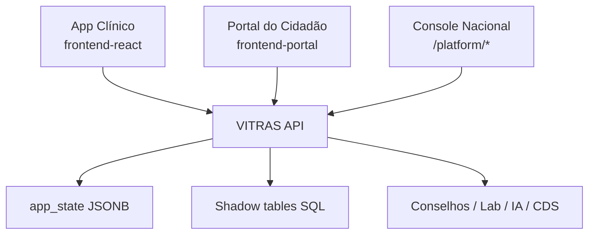
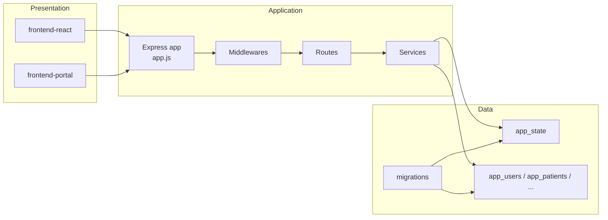
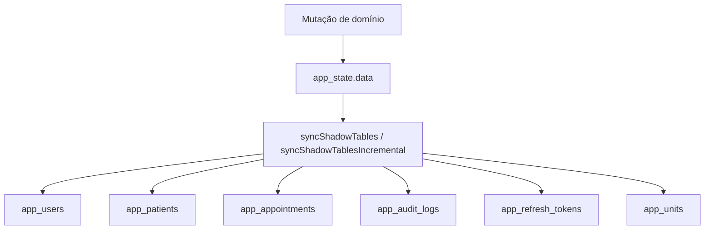

# ARCHITECTURE

## Objetivo
Documentar arquitetura atual do VITRAS em nível suficiente para implantação, sustentação e auditoria técnica.

## Escopo
Backend, frontend, banco, autenticação, autorização, RBAC, multi-tenant, multi-UBS, Patient Global, Indicator Engine, Break Glass, Console Nacional e dependências.

## Pré-requisitos
- `backend/src/app.js`
- `backend/src/db.js`
- `backend/src/routes/platform.js`
- `backend/src/routes/patients.js`
- `backend/src/routes/break-glass.js`
- `backend/src/services/indicator-attribution-engine.js`
- `frontend-react/src/App.jsx`
- `frontend-portal/src/App.jsx`

## Descrição
VITRAS usa arquitetura modular monolítica no backend, dois frontends independentes e persistência híbrida centrada em JSONB com projeções relacionais para consulta.

## Status de maturidade
### IMPLEMENTADO
- API central única com composição por routers
- Separação entre frontends clínico e portal cidadão
- Console nacional restrito a `support_admin`
- RBAC por capabilities e guards específicos
- Persistência JSONB + shadow tables + migrações
- Atribuição territorial e operacional por serviço dedicado

### PARCIAL
- OpenAPI ainda não cobre todas as rotas montadas em `app.js`
- Algumas decisões arquiteturais futuras vivem em ADRs e documentos de arquitetura, sem plena materialização no runtime

### ROADMAP
- Separação física adicional entre metadata platform e banco clínico aparece em documentação de arquitetura, mas não é garantida como implantação padrão atual

## Diagrama de contexto

## Diagrama de containers

## Camadas
### Frontend
- `frontend-react`: operação clínica, territorial e gerencial da UBS
- `frontend-portal`: jornada do cidadão
- Padrão SPA com consumo da API central via `src/api.js` e serviços específicos

### Backend
- `app.js`: composição de middlewares e ordem de montagem
- `routes/*`: fronteira HTTP por domínio
- `services/*`: regras transversais e engines
- `middlewares/*`: autenticação, CSRF, segurança, métricas, logs, rate limit
- `utils/*`: RBAC, helpers de domínio, validações e formatações

### Persistência
- Fonte de verdade: `app_state.data` em PostgreSQL
- Desenvolvimento local: `data/db.json`
- Projeções relacionais para consulta: usuários, pacientes, agendamentos, refresh tokens, auditoria, permissões e unidades

## Frontend
### App clínico
- Shell principal em `frontend-react/src/App.jsx`
- Domínios refletidos em páginas como `PatientsPage.jsx`, `AgendaPage.jsx`, `QueuePage.jsx`, `ReferralsPage.jsx`, `PlatformConsolePage.jsx`
- Contexto de unidade ativa em `frontend-react/src/contexts/ActiveUnitContext.jsx`

### Portal cidadão
- App independente em `frontend-portal/src/App.jsx`
- Serviços dedicados para autenticação, perfil, jornada de agendamento e configuração municipal

## Backend
### Ordem de montagem relevante
1. Health, Swagger, Auth, rotas públicas e laboratório público
2. Rotas `/platform`, `/territorial`, `/citizen-portal*`
3. `requireAuth`
4. `blockSupportAdminFromClinical`
5. `requireCsrfForCookieAuth`
6. `resolveBreakGlassSession`
7. Rotas clínicas, operacionais, IA, auditoria e privacidade

### Módulos principais
| Módulo | Arquivo | Papel |
|---|---|---|
| Auth | `backend/src/routes/auth.js` | login, refresh, acesso, registro |
| Me | `backend/src/routes/me.js` | perfil, 2FA, impersonation, break glass de sessão |
| Patients | `backend/src/routes/patients.js` | cadastro, histórico, prontuário, mensagens |
| Platform | `backend/src/routes/platform.js` | municípios, UBS, equipes, gestor inicial |
| Territorial | `backend/src/routes/territorial.js` | microáreas da UBS |
| Production | `backend/src/routes/production.js` | indicadores territoriais e operacionais |
| Audit | `backend/src/routes/audit-logs.js` | trilha e relatórios |
| Import | `backend/src/routes/import.js` | pipeline de importação e staging |

## Autenticação
- JWT de acesso + refresh token
- Cookie auth suportado com CSRF
- 2FA TOTP interno
- Impersonation restrita a perfis técnicos
- Break Glass com TTL e senha de reautenticação

## Autorização e RBAC
- Matriz central em `backend/src/utils/helpers.js`
- `ROLE_CAPABILITIES` define permissões base
- Break glass pode elevar capabilities em sessão
- Há guards adicionais por rota, por tipo de registro e por escopo municipal/equipe

## Multi-tenant, multi-UBS e Patient Global
### IMPLEMENTADO
- `municipalityId`, `unitId` e `teamId` usados na maioria dos fluxos clínicos
- Leitura cross-UBS no mesmo município para alguns perfis clínicos, preservando bloqueio cross-municipality
- `support_admin` isolado em rotas platform e bloqueado das rotas clínicas por `blockSupportAdminFromClinical`

### PARCIAL
- Alguns documentos de arquitetura descrevem evolução nacional mais ampla que ainda depende de rollout adicional

## Indicator Engine
- Serviço: `backend/src/services/indicator-attribution-engine.js`
- Separa atribuição territorial de atribuição operacional
- Não recalcula histórico a partir do estado atual do paciente
- Marca eventos legados ambíguos sem inventar atribuição

## Break Glass
- Rota dedicada: `backend/src/routes/break-glass.js`
- Requer capability `break_glass.activate`, `patientId` e senha
- TTL fixo atual: 30 minutos
- Gera eventos de auditoria de falha, ativação e desativação

## Console Nacional
- Implementado em `backend/src/routes/platform.js`
- Escopo atual: municípios, UBS, equipes, gestor inicial, configuração operacional, trilha de plataforma
- Controle de acesso exclusivo para `support_admin`
- Não reutiliza telas clínicas para operação nacional

## Banco de dados

## Dependências
- `pg`: acesso PostgreSQL
- `jsonwebtoken`: emissão e validação JWT
- `otplib`: TOTP
- `helmet`, `cors`, `compression`: camada HTTP
- `@upstash/ratelimit`, `@upstash/redis`: limitação distribuída
- `zod`: validações de schema em partes do sistema

## Boas práticas
- Nova rota clínica deve entrar após `requireAuth` e `blockSupportAdminFromClinical`
- Regra de negócio deve ficar em rota, service ou util, não em componente visual
- Atribuição territorial e operacional deve usar engine dedicada

## Referências internas
- `backend/src/app.js`
- `backend/src/db.js`
- `backend/src/routes/platform.js`
- `backend/src/routes/break-glass.js`
- `backend/src/services/indicator-attribution-engine.js`
- `docs/ai/routes-map.md`
- `docs/architecture/VITRAS-NATIONAL-CONSOLE-ERP-ARCHITECTURE-01.md`

## Arquivos relacionados
- `docs/03-security/SECURITY.md`
- `docs/04-data-model/DATA-MODEL.md`
- `docs/06-infrastructure/INFRASTRUCTURE.md`
