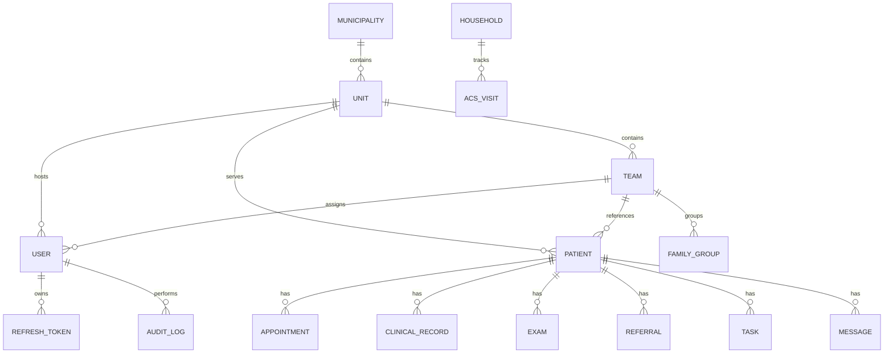

# DATA MODEL

## Objetivo
Descrever modelo de dados atual do VITRAS, incluindo fonte de verdade, projeções relacionais, entidades principais e restrições de uso.

## Escopo
Arquitetura de armazenamento, entidades de negócio, relações, constraints, índices e exemplos.

## Pré-requisitos
- `backend/src/db.js`
- `backend/src/migrations/*`
- `docs/ai/entities-map.md`

## Descrição
VITRAS mantém estado principal em JSONB no PostgreSQL (`app_state`) e gera shadow tables para busca, paginação, integridade e queries SQL específicas.

## Arquitetura de armazenamento
### IMPLEMENTADO
- `app_state` como fonte de verdade
- Shadow tables: `app_users`, `app_patients`, `app_appointments`, `app_audit_logs`, `app_refresh_tokens`, `app_role_permissions`, `app_units`
- Modo arquivo para desenvolvimento local

### PARCIAL
- Nem todas entidades do domínio possuem shadow table dedicada
- Parte do domínio ainda vive como arrays aninhados no JSONB

## Regras gerais
- Escritas em PostgreSQL usam lock transacional em `app_state`
- Dados sensíveis são serializados criptografados antes de persistir
- Índices e constraints relacionais coexistem com validações em runtime

## Entidades documentadas
- Municipality
- Unit
- Team
- User
- Patient
- ClinicalRecord
- Appointment
- QueueEntry
- AgendaEntry
- Exam
- ExamRequest
- Referral
- Task
- FamilyGroup
- Household
- AcsVisit
- AuditLog
- BreakGlassSession
- RefreshToken
- AccessRequest
- PrivacyRequest
- ProtocolTemplate
- Notification
- LabIntegration

## Relações principais

## Índices e constraints relevantes
| Item | Implementação |
|---|---|
| CPF/CNS únicos por hash | migration 006 |
| `municipality_id` em projeções | migration 010 |
| tabela `municipalities` | migration 021 |
| FK de `app_units.municipality_id` | migration 022 |
| UUID interno em municípios | migration 033 |

## Observações de modelagem
- `ClinicalRecord`, `messages` e parte do histórico ainda são arrays vinculados ao paciente no estado principal
- `BreakGlassSession` e `microAreas` existem no estado de domínio mesmo sem tabela shadow dedicada
- `Municipality` já existe como tabela relacional, diferente de outros agregados puramente JSONB

## Entidades detalhadas
Consultar pasta `entities/`.

## ERD
Consultar `ERD.md`.

## Boas práticas
- Nova entidade sensível deve avaliar shadow table, criptografia e auditoria
- Nunca assumir que array JSONB implica ausência de regra relacional
- Sempre distinguir campo de referência territorial de campo operacional

## Referências internas
- `backend/src/db.js`
- `backend/src/migrations/006_patient_hash_columns.js`
- `backend/src/migrations/021_create_municipalities.js`
- `backend/src/migrations/033_add_uuid_pk_to_municipalities.js`

## Arquivos relacionados
- `docs/04-data-model/ERD.md`
- `docs/05-api/API-GUIDE.md`
