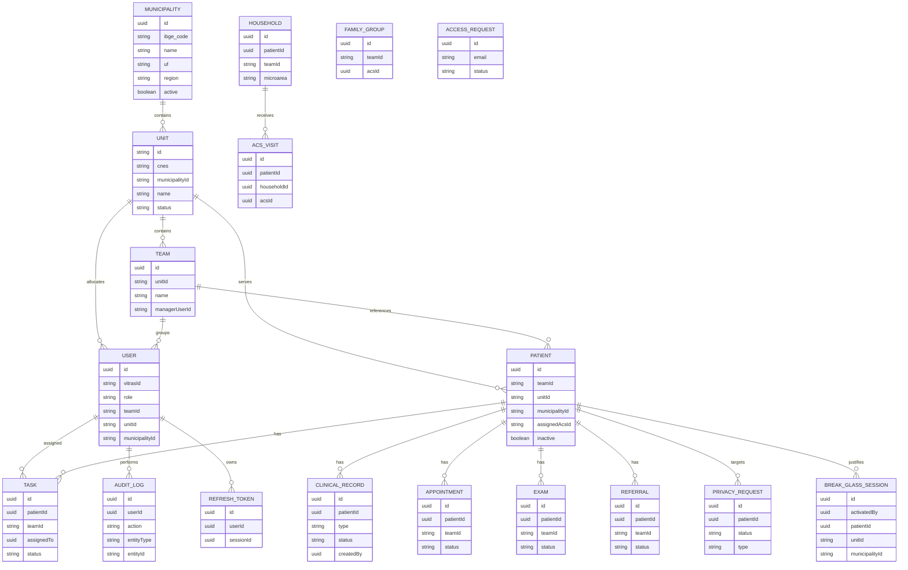

# ERD

## Objetivo
Fornecer diagrama textual consolidado do modelo relacional e lógico atual do VITRAS.

## Escopo
Entidades centrais clínicas, territoriais, segurança e platform.

## Pré-requisitos
- `backend/src/db.js`
- `backend/src/migrations/*`

## Descrição
ERD abaixo combina entidades materializadas em SQL com agregados persistidos em JSONB, para leitura arquitetural completa.

## Status
- ERD lógico completo: IMPLEMENTADO neste documento
- ERD físico 100% relacional: PARCIAL, porque fonte principal segue híbrida JSONB + projeções

## Referências internas
- `backend/src/db.js`
- `docs/ai/entities-map.md`

## Arquivos relacionados
- `docs/04-data-model/DATA-MODEL.md`
