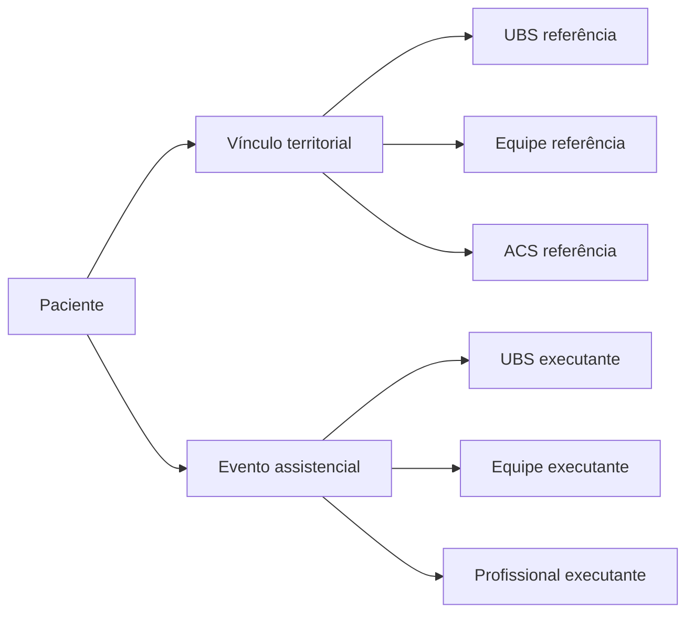

# CLINICAL ARCHITECTURE

## Objetivo
Explicar modelo assistencial atual do VITRAS e como ele separa responsabilidade sanitária de produção operacional.

## Escopo
Territorialização, Patient Global, UBS/equipe/ACS de referência, cross-UBS, indicadores, eventos clínicos, histórico e Break Glass.

## Pré-requisitos
- `backend/src/services/indicator-attribution-engine.js`
- `backend/src/routes/patients.js`
- `backend/src/routes/territorial.js`
- `backend/src/routes/acs-visits.js`

## Descrição
VITRAS trata cuidado APS como combinação de referência territorial e execução operacional. Mesmo evento clínico pode ter unidade de referência diferente da unidade executante.

## Territorialização
### IMPLEMENTADO
- Microáreas por UBS
- Cadastro domiciliar e grupos familiares
- Atribuição de ACS por paciente
- Indicadores territoriais por unidade, equipe e ACS

## Patient Global
### IMPLEMENTADO
- Leitura clínica municipal controlada para perfis elegíveis
- Bloqueio cross-municipality
- Registro de acesso cross-team

### PARCIAL
- Evolução nacional completa depende de arquitetura platform mais ampla já documentada em outros artefatos

## UBS de referência
- Campo de referência territorial é distinto do local de execução
- `referenceUnitIdAtEvent` é fonte preferencial para territorial

## Equipe de referência
- `referenceTeamIdAtEvent` compõe atribuição territorial
- Time atual do paciente não deve reescrever retrospectivamente evento antigo

## ACS de referência
- `referenceAcsIdAtEvent` define responsável sanitário territorial quando disponível
- ACS também possui visitas e tarefas próprias

## Atendimento cross-UBS
- Permitido apenas em contexto clínico e municipal compatível
- Não abre escrita indiscriminada
- Gera rastreabilidade em auditoria

## Produção operacional
- Usa `executingUnitId`, `executingTeamId`, `executingProfessionalId`
- Mede onde produção ocorreu, não quem tinha responsabilidade territorial

## Indicadores
- Engine central em `indicator-attribution-engine.js`
- Eventos ambíguos legados não são inventados; ficam marcados como ambíguos

## Eventos clínicos
- Exemplos: visita ACS, agenda, exame, solicitação de exame, encaminhamento, odontologia, receita, dispensação
- Cada evento pode carregar campos canônicos de atribuição

## Histórico imutável
- Registros clínicos usam soft-delete/inativação
- Atribuição histórica não deve ser recalculada a partir do estado atual

## Break Glass
- Uso emergencial para acesso com justificativa operacional
- Sessão temporária e auditável

## Responsabilidade sanitária x produção operacional
| Conceito | Pergunta respondida | Campos principais |
|---|---|---|
| Responsabilidade Territorial | quem responde sanitariamente por este cuidado? | `referenceUnitIdAtEvent`, `referenceTeamIdAtEvent`, `referenceAcsIdAtEvent` |
| Produção Operacional | onde e por quem este cuidado foi executado? | `executingUnitId`, `executingTeamId`, `executingProfessionalId` |

## Diagrama

## Boas práticas
- Não usar unidade executante para territorialização
- Não inferir retrospectivamente eventos ambíguos
- Tratar Break Glass como exceção controlada

## Referências internas
- `backend/src/services/indicator-attribution-engine.js`
- `backend/src/routes/production.js`
- `backend/src/routes/patients.js`

## Arquivos relacionados
- `docs/02-architecture/ARCHITECTURE.md`
- `docs/04-data-model/DATA-MODEL.md`
